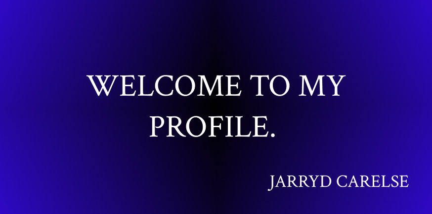

<!-- Header Image and Profile Image -->

# Hi there, I'm Jarryd Carelse! 👋

## About Me
I'm an Interactive Development student at Open Window in South Africa, passionate about designing and developing digital experiences that engage users. I enjoy working on projects in various fields, including real estate, cars and fitness, focusing on combining creativity and technical skills.

---

## 🌟 Portfolio Projects (DV 200 Term 1-4)

Here are my major projects, with each repository including detailed documentation and process insights:

1. **[Term 1 Project](link-to-term-1-repo)** - Brief description of the project
2. **[Term 2 Project](link-to-term-2-repo)** - Brief description of the project
3. **[Term 3 Project](link-to-term-3-repo)** - Brief description of the project
4. **[Term 4 Project](link-to-term-4-repo)** - Brief description of the project

*Make sure these repositories are set to public for easy access during the presentation.*

---

## 📊 GitHub Statistics
 <!-- Replace `your-username` with your GitHub username -->

## 🛠️ Skills
- **Languages:** JavaScript, HTML, CSS, PHP, SQL
- **Frameworks/Libraries:** React Native, Expo
- **Tools:** Figma, XAMPP, Visual Studio Code

---

## 📫 Contact Me
- **Email:** [your-email@example.com](mailto:your-email@example.com)
- **LinkedIn:** [Your LinkedIn Profile](link-to-linkedin)
