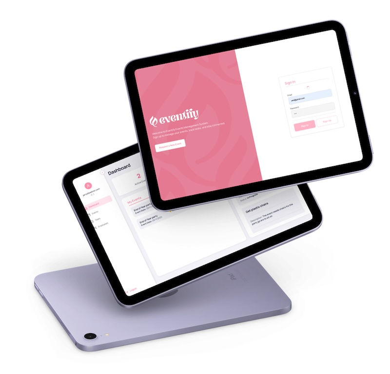
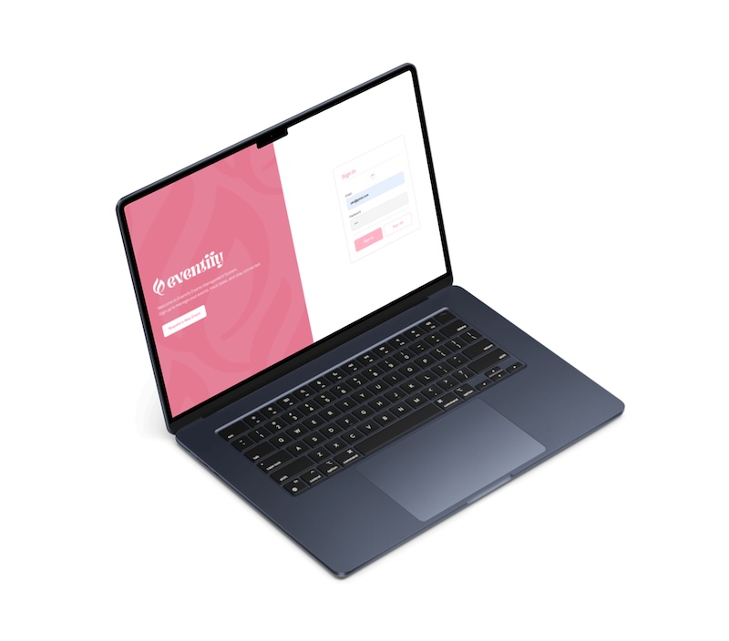
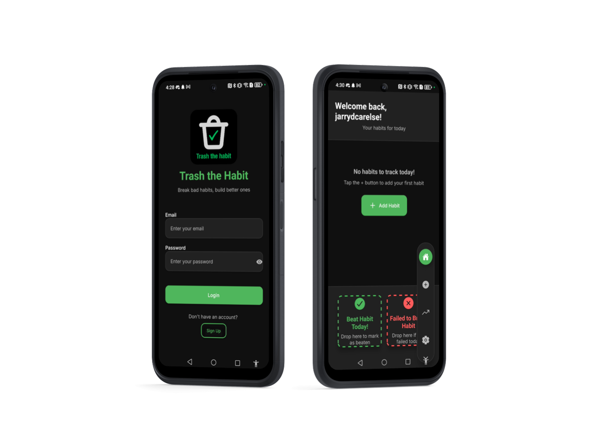

<!-- Header Image -->

#  Hello, I’m Jarryd Carelse  

## About Me  
I’m an Interactive Development student at Open Window in South Africa, currently building my skills in mobile development, frontend engineering, backend APIs, and UI/UX design. I enjoy creating digital products that feel clean, intuitive, and reliable, from web dashboards to mobile apps and AI-powered tools.

I approach every project as an opportunity to learn something new, improve my problem-solving, and build solutions that feel genuinely useful.

---

##  Featured Projects

Below are the three major projects I’ve completed, each showing different areas of my development journey—web dashboards, mobile interaction design, and AI-assisted applications.

---

### **1. UNO Event Management, Event, Task & Employee Platform**  
**Repo:** [UNO Event Management – Frontend](https://github.com/jarrydcarelse/UNO-Event-management---Frontend.git)

  
  

A full event and staff management dashboard designed to function like a real company system.  
It includes authentication, task tracking, event overviews, and dynamic metrics for employees and admins.

**What the project taught me:**  
How to connect a React frontend to a real .NET backend with proper REST API structure, JWT authentication, and PostgreSQL.

**Highlights**
- Login + secure admin-gated signup  
- CRUD functionality for events, tasks, and employees  
- Event-specific task assignment  
- Real-time progress and dashboard metrics  
- Fully responsive dashboard UI  
- Deployed using Netlify  

**Tech Stack**  
React, CRA, react-router-dom, Axios, CSS Modules, Jest  
**Backend:** .NET 8, PostgreSQL, JWT Auth, Swagger API docs

---

### **2. Trash the Habit, Gamified Habit-Breaking App**  
**Repo:** [Trash the Habit](https://github.com/Jarryd-Carelse/DV300--Trash-the-habit.git)

  
  

A mobile app designed to help users break bad habits using gamification, drag-and-drop interactions, and visual progress tracking.

**What the project taught me:**  
How to build a modern React Native app with gesture-based UI, real-time database syncing, and offline functionality.

**Highlights**
- Email/password login via Firebase  
- Real-time habit syncing using Firestore  
- Drag-and-drop habit actions (Reanimated + Gesture Handler)  
- Weekly charts for progress tracking  
 

**Tech Stack**  
React Native (Expo), Firebase Auth & Firestore, Reanimated, Chart Kit, AsyncStorage

---

### **3. SmartCoach, AI Golf Practice Assistant**  
**Repo:** [SmartCoach](https://github.com/jarrydcarelse/smart-coach.git)

  
  

An AI-powered mobile coach that creates personalised golf practice plans through a chat interface.  
The app uses Google Gemini to generate structured sessions based on the user’s handicap and goal.

**What the project taught me:**  
How to integrate a mobile frontend with a Python Flask backend, call AI models safely, and format structured AI responses in the UI.

**Highlights**
- Chat-based coaching experience  
- Structured practice plans (drills, cues, safety notes)  
- Handicap-aware personalisation  
- Save drills, sessions, and achievements  
- Sound + haptic feedback for smoother UX  
- Full Expo/TypeScript mobile workflow  

**Tech Stack**  
Expo (React Native), TypeScript, Firebase, Flask, google-genai (Gemini), Axios

---

##Technical Skills

### **Languages & Frameworks**

### **Tools & Platforms**

### **Mobile & UX**

### **AI / Backend**

---

##  GitHub Statistics  

### **Overall Stats**

### **Most Used Languages**

### **Contribution Streak**

---

##  What I’m Currently Working On  
- Expanding SmartCoach with better plan generation  
- Improving animations and gestures in React Native  
- Strengthening my TypeScript workflow  
- Exploring more AI-driven features for mobile apps  

---

## Get in Touch  
Let’s collaborate or chat about development, UI/UX, or building mobile apps and AI tools.  
**Email:** 221267@virtualwindow.co.za  
